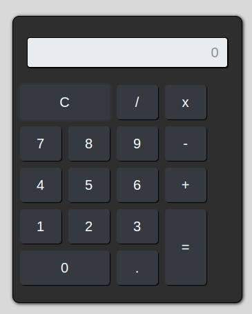
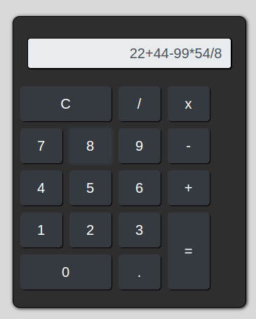
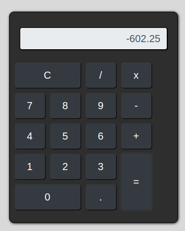

# App-Calculadora
Este projeto é uma calculadora simples que permite realizar operações matemáticas básicas. Ela foi desenvolvida utilizando HTML, CSS e JavaScript, e usa o framework Bootstrap para estilização.

## Funcionalidades
- **Operações Básicas:** Suporta adição, subtração, multiplicação e divisão.
- **Limpar:** Um botão "C" para limpar o visor da calculadora.
- **Ponto Decimal:** Permite a entrada de números decimais.
- **Avaliação de Expressões:** Usa a função eval do JavaScript para calcular o resultado das expressões inseridas.

## Estrutura do Código

### HTML
O arquivo HTML define a estrutura da calculadora e inclui:
- Um campo de entrada (input) para exibir o resultado.
- Botões para números de 0 a 9, operações matemáticas, ponto decimal e um botão para limpar.
- Uso de classes do Bootstrap para estilização e layout responsivo.
  
### CSS
O arquivo estilo.css contém regras de estilo personalizadas para:
- Estilização da calculadora (.calculadora) para um visual moderno.
- Configurações de tamanho e aparência dos botões.
- Estilização do campo de entrada para o visor da calculadora.
  
### JavaScript
O script JavaScript implementa a lógica da calculadora:
**A função calcular(tipo, conteudo) gerencia as entradas e ações do usuário.**

#### Se o tipo for 'acao':
- 'c' limpa o visor.
- '=' avalia a expressão matemática atual e atualiza o visor com o resultado.
- Outras ações (como '+', '-', '*', '/', '.') são adicionadas ao visor.
  
#### Se o tipo for 'valor':
- o número é adicionado ao visor.


## Estrutura de Arquivos
- **index.html**: Contém a estrutura HTML da calculadora.
- **estilo.css**: Contém as regras de estilo personalizadas.
- **script.js**: Contém a lógica JavaScript da calculadora.
  
## Tecnologias Utilizadas
- HTML5
- CSS3
- JavaScript
- Bootstrap 4

## Capturas de Tela
- **Inicio:**


- **Calculando:**


- **Resultado:**


## Como Usar
- Clone o repositório para o seu ambiente local:
```bash
   git clone https://github.com/richard-lino/App-Calculadora.git
```
- Navegue até o diretório do projeto:
```bash
   cd App-Calculadora
```
- Abra o arquivo index.html em um navegador web.
